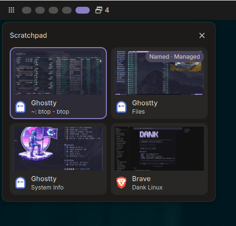
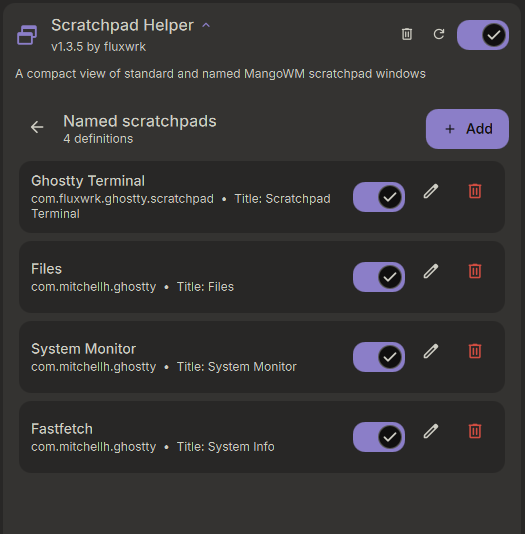

# Scratchpad Helper

<p align="center">
  
</p>

Scratchpad Helper is a DankMaterialShell plugin for mango that adds a visual scratchpad picker to DankBar. It supports standard scratchpads, cached previews, and optional managed named scratchpads.

## Requirements

- DankMaterialShell 1.5.0 or newer. Development is tested with DMS 1.5.3.
- mango 0.16.0 (tested).
- `mmsg`, included with mango, for the helper stash command.
- `grim` is optional. Without it, cards use app icons instead of cached previews.

## Installation

Until the plugin is available through the DMS plugin registry, copy or symlink this repository into the DMS plugins directory:

```sh
mkdir -p ~/.config/DankMaterialShell/plugins
ln -s /path/to/dms-scratchpad-helper ~/.config/DankMaterialShell/plugins/ScratchpadHelper
dms ipc call plugin-scan scan
```

Enable Scratchpad Helper in DMS Settings, then add it to DankBar. You can also add the optional Control Center widget if you want quick access there.

## Usage

Click the DankBar widget to open the scratchpad picker. You can also open it from a keybind with:

```sh
dms ipc call scratchpadHelper togglePicker
```

For example, in mango:

```ini
bind=SUPER,P,spawn,dms ipc call scratchpadHelper togglePicker
```

Standard scratchpads reported by mango appear automatically. Click a card to restore that exact window.

To stash the focused window through the helper, run:

```sh
dms ipc call scratchpadHelper stash
```

For example, in mango:

```ini
bind=SUPER,S,spawn,dms ipc call scratchpadHelper stash
```

When `grim` is available, the plugin saves a preview before stashing. The DankBar picker supports arrow-key navigation, Enter to restore, and Escape to close.

## Named scratchpads

<p align="center">
  
</p>

Named scratchpad management is optional:

1. Enable **Named Scratchpad Manager** in the plugin settings.

2. Add this line once to `~/.config/mango/config.conf`:
   
   ```ini
   source-optional=~/.config/mango/scratchpad-helper.conf
   ```

3. Create a definition in the manager.

4. Select **Generate config**.

5. Select **Reload Mango**.

Scratchpad Helper only generates `~/.config/mango/scratchpad-helper.conf`. It will never edit your main mango config.

A **Managed** card is linked to one of your definitions and can be toggled from the picker. **External** named scratchpads are still shown, but aren't clickable.

## Known issues

- mango 0.16.0 has an upstream bug that can affect helper-triggered stashing if the target window disappears during the operation. See [mango issue #1289](https://github.com/mangowm/mango/issues/1289).
- DMS 1.5.3 generates an outdated mango action for **Toggle Named Scratchpad** keybinds. See [DMS issue #3102](https://github.com/AvengeMedia/DankMaterialShell/issues/3102).
